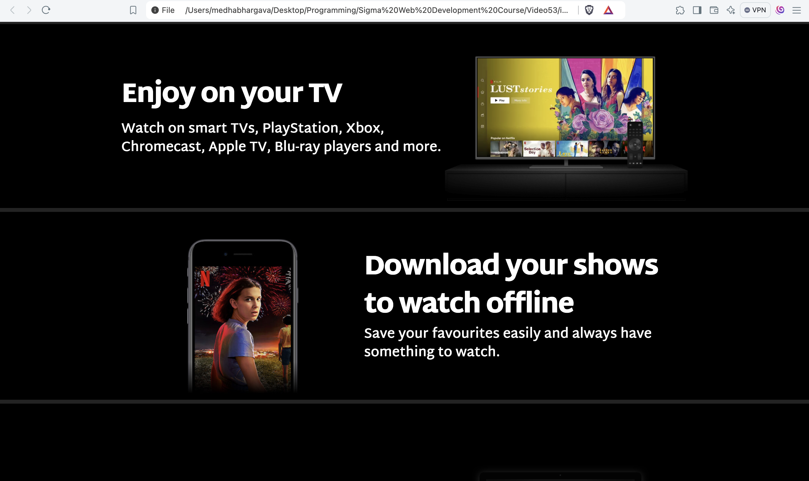
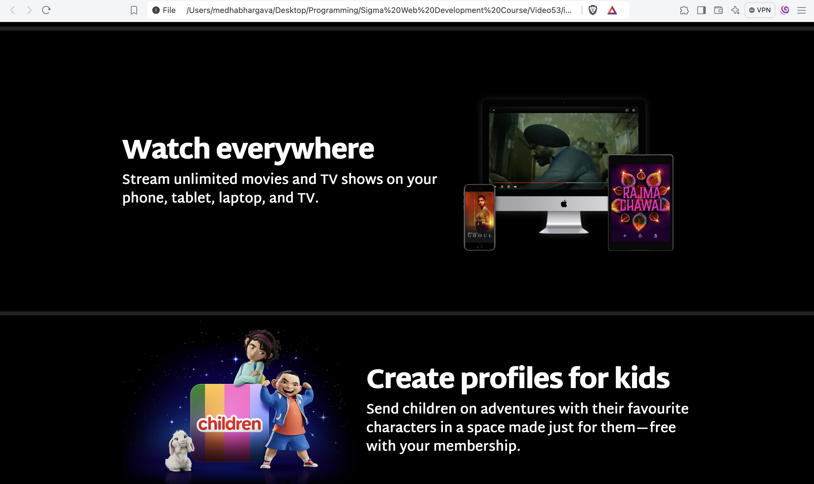
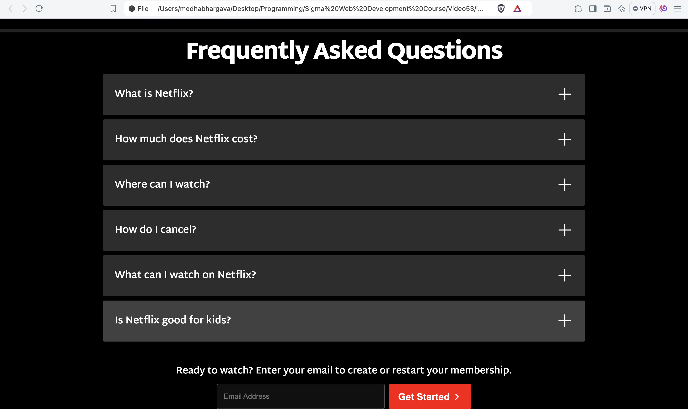
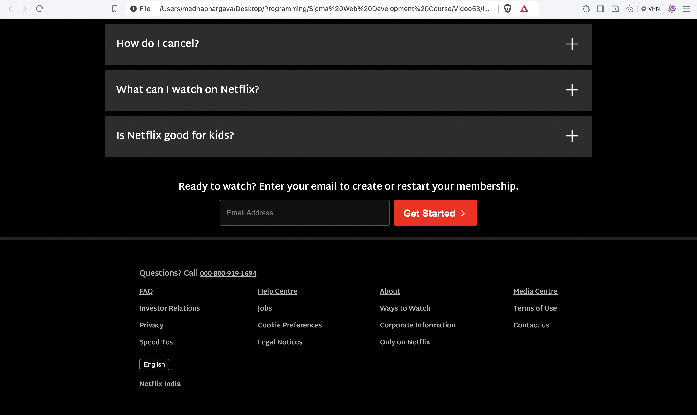

# Netflix Clone
The following repository contains the code which can be rendered to obtain a clone of the Netflix homepage.

The Netflix homepage has been created using HTML and CSS.

Special thanks to [CodeWithHarry](https://github.com/CodeWithHarry) for the wonderful tutorial!